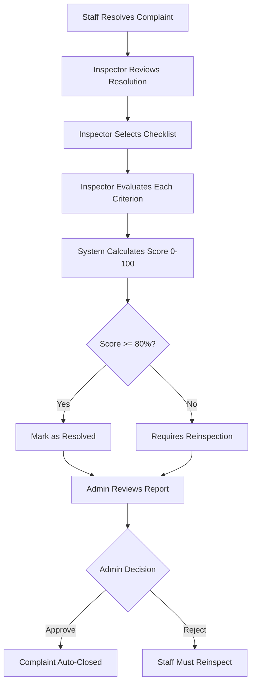

# 🔍 Inspector System - Complete Guide

## Overview

The Rail Madad system includes a comprehensive **Inspection System** that allows inspectors to verify complaint resolutions and ensure quality standards are met. This system provides accountability and quality assurance for the complaint resolution process.

---

## 🎯 Inspector Role

### What is an Inspector?

An **Inspector** is a special type of staff member who:
- Verifies that resolved complaints meet quality standards
- Uses department-specific checklists to evaluate resolutions
- Submits detailed inspection reports with scores
- Recommends whether complaints should be closed or require reinspection

### Inspector vs Regular Staff

| Feature | Regular Staff | Inspector |
|---------|--------------|-----------|
| Can resolve complaints | ✅ Yes | ✅ Yes |
| Can submit inspection reports | ❌ No | ✅ Yes |
| Access to checklists | ❌ No | ✅ Yes |
| Can score resolution quality | ❌ No | ✅ Yes |
| Reports reviewed by admin | ❌ No | ✅ Yes |

---

## 🔐 Inspector Account Details

### Default Inspector Account
```
Email: inspector@railmadad.com
Password: password123
Role: staff (with special privileges)
```

### Creating Additional Inspectors

#### Option 1: Using the Script
```powershell
# Run the add-inspector script
node scripts/add-inspector.ts
```

#### Option 2: Manual Database Entry
1. Create a staff user account
2. Assign email starting with "inspector" (e.g., `inspector1@railmadad.com`)
3. Grant staff role permissions
4. Optionally assign to specific department

#### Option 3: Upgrade Existing Staff
Any staff member can function as an inspector - they just need access to the inspection endpoints.

---

## 📋 Inspection Workflow

### Step-by-Step Process



### Detailed Workflow

1. **Complaint Resolution**
   - Staff member resolves a complaint
   - Complaint status changes to "resolved"

2. **Inspector Assignment**
   - Admin or system assigns inspector
   - Inspector receives notification

3. **Inspection Process**
   - Inspector accesses resolved complaint
   - Selects appropriate checklist (based on category)
   - Evaluates each criterion (Pass/Fail)
   - Adds inspection notes
   - Can attach photo evidence

4. **Score Calculation**
   - System automatically calculates score
   - Score = (Items Passed / Total Items) × 100
   - Example: 8/10 items passed = 80%

5. **Report Submission**
   - Inspector submits report
   - Status: "pending_admin_review"
   - Admin receives notification

6. **Admin Review**
   - Admin reviews inspection report
   - Can approve or reject
   - Can add admin comments
   - Decision determines complaint closure

7. **Automatic Actions**
   - Score ≥ 80% + Approved → Complaint closed
   - Score < 80% → Requires reinspection
   - Rejected → Staff must redo resolution

---

## 📊 Database Schema

### Inspection Reports Table
```sql
inspectionReports:
  - id (UUID, Primary Key)
  - complaintId (UUID, Foreign Key → complaints)
  - checklistId (UUID, Foreign Key → inspectionChecklists)
  - inspectorUserId (UUID, Foreign Key → users)
  - inspectionResults (JSON)
  - overallScore (Integer 0-100)
  - status (enum: pending_admin_review, approved, rejected, requires_reinspection)
  - inspectorNotes (Text)
  - adminNotes (Text)
  - adminUserId (UUID, Foreign Key → users)
  - isComplaintResolved (Boolean)
  - createdAt (DateTime)
  - reviewedAt (DateTime)
```

### Inspection Checklists Table
```sql
inspectionChecklists:
  - id (UUID, Primary Key)
  - departmentId (UUID, Foreign Key → departments)
  - name (Text)
  - description (Text)
  - category (enum: cleanliness, food_quality, staff_behavior, security, facilities, technical)
  - checklistItems (JSON Array)
  - isActive (Boolean)
  - createdAt (DateTime)
  - updatedAt (DateTime)
```

### Checklist Items Structure (JSON)
```json
[
  {
    "id": "1",
    "criterion": "Cleanliness standards met",
    "weight": 10,
    "required": true
  },
  {
    "id": "2",
    "criterion": "All surfaces sanitized",
    "weight": 10,
    "required": true
  },
  {
    "id": "3",
    "criterion": "Waste properly disposed",
    "weight": 10,
    "required": false
  }
]
```

---

## 🛠️ API Endpoints

### 1. Submit Inspection Report
**Endpoint**: `POST /api/inspection/submit-report`

**Access**: Staff/Inspector only

**Request Body**:
```json
{
  "complaintId": "complaint-uuid",
  "checklistId": "checklist-uuid",
  "inspectionResults": {
    "item1": true,
    "item2": false,
    "item3": true
  },
  "overallScore": 75,
  "inspectorNotes": "Cleanliness standards mostly met, but restroom needs improvement"
}
```

**Response**:
```json
{
  "success": true,
  "report": {
    "id": "report-uuid",
    "complaintId": "complaint-uuid",
    "overallScore": 75,
    "status": "pending_admin_review",
    "createdAt": "2025-10-12T10:30:00Z"
  }
}
```

**Usage Example**:
```typescript
const submitInspection = async (complaintId: string) => {
  const response = await fetch('/api/inspection/submit-report', {
    method: 'POST',
    headers: { 'Content-Type': 'application/json' },
    credentials: 'include',
    body: JSON.stringify({
      complaintId,
      checklistId: selectedChecklistId,
      inspectionResults: evaluationResults,
      overallScore: calculateScore(evaluationResults),
      inspectorNotes: notes
    })
  });
  
  if (response.ok) {
    const data = await response.json();
    toast.success('Inspection report submitted successfully!');
    return data.report;
  }
};
```

---

### 2. Get Inspection Checklists
**Endpoint**: `GET /api/inspection/checklists`

**Access**: Staff/Inspector/Admin

**Query Parameters**:
- `departmentId` (optional): Filter by department
- `category` (optional): Filter by category

**Example**:
```
GET /api/inspection/checklists?category=cleanliness
```

**Response**:
```json
{
  "checklists": [
    {
      "id": "checklist-uuid",
      "name": "Cleanliness Inspection Checklist",
      "description": "Standard checklist for cleanliness-related complaints",
      "category": "cleanliness",
      "departmentName": "Housekeeping",
      "checklistItems": [
        {
          "id": "1",
          "criterion": "Coach floors cleaned",
          "weight": 10,
          "required": true
        },
        {
          "id": "2",
          "criterion": "Restrooms sanitized",
          "weight": 10,
          "required": true
        }
      ],
      "isActive": true
    }
  ]
}
```

---

### 3. Admin Approve Inspection Report
**Endpoint**: `POST /api/inspection/approve-report`

**Access**: Admin only

**Request Body**:
```json
{
  "reportId": "report-uuid",
  "approved": true,
  "adminComments": "Quality inspection, standards met"
}
```

**Response**:
```json
{
  "success": true,
  "message": "Inspection report approved successfully",
  "report": {
    "id": "report-uuid",
    "status": "approved",
    "reviewedAt": "2025-10-12T11:00:00Z",
    "complaintClosed": true
  }
}
```

---

### 4. Get Inspection Reports
**Endpoint**: `GET /api/inspection/reports`

**Access**: Admin/Inspector

**Query Parameters**:
- `complaintId` (optional): Get reports for specific complaint
- `inspectorId` (optional): Get reports by specific inspector
- `status` (optional): Filter by status (pending_admin_review, approved, rejected)

**Example**:
```
GET /api/inspection/reports?status=pending_admin_review
```

**Response**:
```json
{
  "reports": [
    {
      "id": "report-uuid",
      "complaintId": "complaint-uuid",
      "complaintTitle": "Dirty coach",
      "inspector": {
        "id": "user-uuid",
        "name": "Inspector Kumar",
        "email": "inspector@railmadad.com"
      },
      "checklist": {
        "name": "Cleanliness Inspection",
        "category": "cleanliness"
      },
      "overallScore": 85,
      "status": "pending_admin_review",
      "inspectorNotes": "Standards met, minor issues resolved",
      "createdAt": "2025-10-12T10:30:00Z"
    }
  ]
}
```

---

### 5. Inspection Workflow (Complete)
**Endpoint**: `POST /api/inspection/workflow`

**Access**: Inspector/Admin

**Description**: Complete end-to-end inspection workflow with validation

**Request Body**:
```json
{
  "complaintId": "complaint-uuid",
  "checklistId": "checklist-uuid",
  "inspectionData": {
    "items": {
      "item1": { "passed": true, "notes": "OK" },
      "item2": { "passed": false, "notes": "Needs work" }
    }
  },
  "overallSolved": true,
  "inspectorNotes": "Overall satisfactory"
}
```

---

## 📝 Default Inspection Checklists

### 1. Cleanliness Checklist
**Category**: `cleanliness`
**Department**: Housekeeping

**Criteria** (10 points each):
1. ✅ Coach floors cleaned and swept
2. ✅ Seats and berths dust-free
3. ✅ Windows and glass surfaces clean
4. ✅ Restrooms sanitized and functional
5. ✅ Waste bins emptied and replaced
6. ✅ Bedding clean (if applicable)
7. ✅ Carpets vacuumed (if applicable)
8. ✅ Air vents and ducts cleaned
9. ✅ Handrails and handles sanitized
10. ✅ Overall coach hygiene acceptable

**Passing Score**: ≥ 80% (8/10 items)

---

### 2. Food Quality Checklist
**Category**: `food_quality`
**Department**: Catering

**Criteria** (10 points each):
1. ✅ Food temperature appropriate
2. ✅ Food freshness verified
3. ✅ Proper packaging and sealing
4. ✅ Utensils clean and sanitized
5. ✅ Menu items as described
6. ✅ Portion sizes adequate
7. ✅ Food preparation area clean
8. ✅ Staff hygiene standards met
9. ✅ Expiry dates checked
10. ✅ Customer satisfaction confirmed

**Passing Score**: ≥ 80% (8/10 items)

---

### 3. Staff Behavior Checklist
**Category**: `staff_behavior`
**Department**: Customer Service

**Criteria** (10 points each):
1. ✅ Professional appearance maintained
2. ✅ Polite and courteous communication
3. ✅ Prompt response to queries
4. ✅ Issue resolution attempted
5. ✅ Active listening demonstrated
6. ✅ Appropriate tone and language
7. ✅ Conflict de-escalation handled
8. ✅ Customer needs prioritized
9. ✅ Follow-up action taken
10. ✅ Overall customer satisfaction

**Passing Score**: ≥ 80% (8/10 items)

---

### 4. Security Checklist
**Category**: `security`
**Department**: RPF/Security

**Criteria** (10 points each):
1. ✅ Security personnel present
2. ✅ Emergency equipment accessible
3. ✅ Safety protocols followed
4. ✅ Incident properly documented
5. ✅ Response time adequate
6. ✅ Communication clear
7. ✅ Suspect/threat neutralized
8. ✅ Passenger safety ensured
9. ✅ Evidence preserved (if applicable)
10. ✅ Follow-up actions completed

**Passing Score**: ≥ 80% (8/10 items)

---

### 5. Facilities Checklist
**Category**: `facilities`
**Department**: Maintenance

**Criteria** (10 points each):
1. ✅ Lighting functional
2. ✅ Air conditioning/heating working
3. ✅ Charging points operational
4. ✅ Water supply available
5. ✅ Doors and windows functional
6. ✅ Emergency exits accessible
7. ✅ Fire extinguishers present
8. ✅ First aid kit available
9. ✅ Signage clearly visible
10. ✅ Overall facility condition good

**Passing Score**: ≥ 80% (8/10 items)

---

### 6. Technical Checklist
**Category**: `technical`
**Department**: Engineering

**Criteria** (10 points each):
1. ✅ Equipment repaired/replaced
2. ✅ System testing completed
3. ✅ Safety checks performed
4. ✅ Functionality verified
5. ✅ Documentation updated
6. ✅ Spare parts available
7. ✅ Maintenance schedule followed
8. ✅ No recurring issues detected
9. ✅ Performance meets standards
10. ✅ User acceptance obtained

**Passing Score**: ≥ 80% (8/10 items)

---

## 🎓 How to Use as an Inspector

### Login Process
1. Go to: http://localhost:3000/auth/login
2. Enter credentials:
   - Email: `inspector@railmadad.com`
   - Password: `password123`
3. Click "Login"
4. You'll be redirected to staff dashboard

### Accessing Resolved Complaints
1. Navigate to **Staff Dashboard**
2. Look for complaints with status: "resolved"
3. Click "View Details" on any resolved complaint
4. You should see an "Inspect" or "Submit Inspection" button

### Submitting an Inspection Report

**Step 1: Select Complaint**
```typescript
// Find a resolved complaint
const resolvedComplaints = complaints.filter(c => c.status === 'resolved');
```

**Step 2: Choose Checklist**
```typescript
// Fetch appropriate checklist based on complaint category
const checklists = await fetch(
  `/api/inspection/checklists?category=${complaint.category}`
);
```

**Step 3: Evaluate Criteria**
```typescript
// Mark each criterion as pass/fail
const inspectionResults = {
  "item1": true,  // Passed
  "item2": false, // Failed
  "item3": true,  // Passed
  // ... for all items
};
```

**Step 4: Calculate Score**
```typescript
// Score = (passed items / total items) × 100
const passedItems = Object.values(inspectionResults).filter(v => v).length;
const totalItems = Object.keys(inspectionResults).length;
const score = Math.round((passedItems / totalItems) * 100);
```

**Step 5: Submit Report**
```typescript
await fetch('/api/inspection/submit-report', {
  method: 'POST',
  headers: { 'Content-Type': 'application/json' },
  credentials: 'include',
  body: JSON.stringify({
    complaintId: complaint.id,
    checklistId: checklist.id,
    inspectionResults,
    overallScore: score,
    inspectorNotes: "Your detailed notes here"
  })
});
```

---

## 👨‍💼 Admin Review Process

### Viewing Pending Reports
1. Login as Admin (`admin@railmadad.com` / `admin123`)
2. Go to Admin Dashboard
3. Look for "Inspections" or "Reports" section
4. Filter by status: "pending_admin_review"

### Approving a Report
```typescript
const approveReport = async (reportId: string) => {
  await fetch('/api/inspection/approve-report', {
    method: 'POST',
    headers: { 'Content-Type': 'application/json' },
    credentials: 'include',
    body: JSON.stringify({
      reportId,
      approved: true,
      adminComments: "Quality inspection, standards met"
    })
  });
};
```

### Rejecting a Report
```typescript
const rejectReport = async (reportId: string) => {
  await fetch('/api/inspection/approve-report', {
    method: 'POST',
    headers: { 'Content-Type': 'application/json' },
    credentials: 'include',
    body: JSON.stringify({
      reportId,
      approved: false,
      adminComments: "Inspection incomplete, requires reinspection"
    })
  });
};
```

---

## 📈 Performance Metrics

### Inspector Performance Tracking

**Admin can view**:
- Total inspections completed
- Average inspection score
- Approval rate by admin
- Time taken per inspection
- Department-wise performance

**Endpoint**: `GET /api/admin/performance?days=30`

**Example Response** (Inspector Section):
```json
{
  "inspectionMetrics": {
    "totalReports": 45,
    "approvedReports": 38,
    "rejectedReports": 5,
    "pendingReports": 2,
    "avgScore": 82.5,
    "complaintsResolved": 38
  },
  "inspectorPerformance": [
    {
      "inspectorId": "user-uuid",
      "name": "Inspector Kumar",
      "totalInspections": 25,
      "avgScore": 85,
      "approvalRate": 88
    }
  ]
}
```

---

## 🔔 Notifications

### Inspector Receives Notifications For:
1. ✅ New complaint resolved (ready for inspection)
2. ✅ Admin approves their inspection report
3. ✅ Admin rejects their inspection report
4. ✅ Complaint requires reinspection
5. ✅ Department assigns inspection task

### Admin Receives Notifications For:
1. ✅ Inspector submits new report
2. ✅ High-score report (≥ 90%) submitted
3. ✅ Low-score report (< 60%) submitted
4. ✅ Inspection overdue

---

## 🧪 Testing the Inspection System

### Test Scenario 1: Complete Inspection Flow

**Step 1**: Create and resolve a complaint
```bash
# Login as passenger
# Submit complaint about cleanliness
# Logout
```

**Step 2**: Admin assigns to staff
```bash
# Login as admin
# Assign complaint to staff member
# Logout
```

**Step 3**: Staff resolves complaint
```bash
# Login as staff
# Mark complaint as resolved
# Logout
```

**Step 4**: Inspector inspects
```bash
# Login as inspector
# Find resolved complaint
# Submit inspection report with 85% score
# Logout
```

**Step 5**: Admin reviews
```bash
# Login as admin
# Review inspection report
# Approve report
# Verify complaint auto-closed
```

---

### Test Scenario 2: Failed Inspection

**Step 1-3**: Same as above

**Step 4**: Inspector submits low score
```bash
# Login as inspector
# Submit inspection report with 60% score
# Status should be "requires_reinspection"
# Logout
```

**Step 5**: Admin rejects
```bash
# Login as admin
# Reject inspection report
# Complaint should NOT be closed
# Staff should receive notification to reinspect
```

---

## 🛡️ Security & Permissions

### Role-Based Access Control

| Action | Passenger | Staff | Inspector | Admin |
|--------|-----------|-------|-----------|-------|
| View inspection reports | ❌ No | ❌ No | ✅ Own only | ✅ All |
| Submit inspection reports | ❌ No | ❌ No | ✅ Yes | ✅ Yes |
| Approve/Reject reports | ❌ No | ❌ No | ❌ No | ✅ Yes |
| Create checklists | ❌ No | ❌ No | ❌ No | ✅ Yes |
| View checklists | ❌ No | ✅ Yes | ✅ Yes | ✅ Yes |
| Edit checklists | ❌ No | ❌ No | ❌ No | ✅ Yes |

---

## 📞 Integration Points

### Where Inspector System Connects

1. **Complaint Resolution Flow**
   - After staff resolves → Inspector inspects
   
2. **Admin Dashboard**
   - Shows pending inspection reports
   - Displays inspection statistics
   
3. **Performance Tracking**
   - Tracks inspector efficiency
   - Measures quality scores
   
4. **Notification System**
   - Alerts all stakeholders
   - Maintains communication

5. **Audit Logs**
   - Records all inspection actions
   - Maintains accountability

---

## 🎉 Summary

### Key Features
✅ **Department-specific checklists** (6 categories)  
✅ **Automated score calculation** (0-100%)  
✅ **Admin approval workflow**  
✅ **Automatic complaint closure** (score ≥ 80% + approved)  
✅ **Reinspection process** for failed inspections  
✅ **Performance tracking** for inspectors  
✅ **Real-time notifications** for all parties  
✅ **Detailed inspection history** and audit trail  

### Inspector Account
```
Email: inspector@railmadad.com
Password: password123
Dashboard: http://localhost:3000/staff-dashboard
```

### Quick Commands
```powershell
# Add inspector to database
node scripts/add-inspector.ts

# Test inspection APIs
# (Use Postman or curl with JWT token)
POST http://localhost:3000/api/inspection/submit-report
GET http://localhost:3000/api/inspection/checklists
```

---

**The inspection system is fully implemented and ready to use!** 🚀
